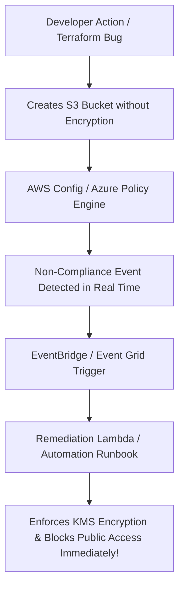

# Cloud Security Posture Management (CSPM) & Compliance

## Executive Summary

Cloud Security Posture Management (CSPM) continuously monitors cloud configurations against regulatory compliance baselines (CIS Benchmarks, NIST CSF, PCI-DSS, ISO 27001) and automatically remediates security drift.

---

## 1. Automated Compliance Drift Remediation

---

## 2. Core CSPM Standards

1. **Mandatory Preventative Controls (Policy as Code)**:
   - Enforce Service Control Policies (AWS SCPs) and Azure Management Group Policies to make it physically impossible to provision unencrypted storage volumes or assign public IP addresses to database subnets.
2. **Automated Drift Detection**:
   - Run hourly compliance evaluations. Automatically alert the Security Operations Center (SOC) if any production resource deviates from the approved architectural baseline.
