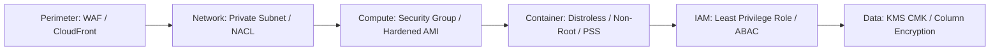

# Defense in Depth: Layered Cloud Security

## Executive Summary

Relying on a single security boundary (e.g., assuming a private subnet makes an application secure) is a fatal architectural flaw. Defense in Depth mandates that every tier enforces its own independent authentication, authorization, and encryption controls.

---

## 1. Multi-Layer Control Mapping

---

## 2. The Fallacy of Network-Only Trust

- **Traditional View**: "The database is in a private subnet, so we do not need database passwords or TLS encryption."
- **Enterprise Cloud Reality**: If an attacker exploits an SSRF vulnerability in a public web application, they execute code directly inside the private subnet. If the database lacks strict IAM authentication and TLS encryption, the attacker achieves total data exfiltration.
- **Rule**: All internal east-west traffic across private subnets must be encrypted with **TLS 1.3** and require strong cryptographic authentication.
