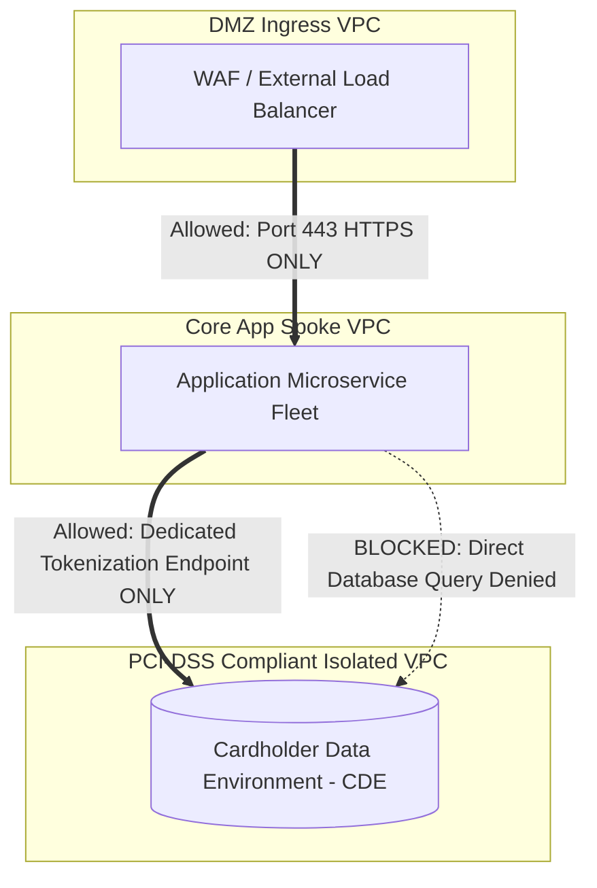

# Cloud Network Micro-Segmentation Architecture

## Executive Summary

Micro-segmentation restricts lateral movement by isolating network assets into granular, logically partitioned zones with explicit default-deny boundaries.

---

## 1. Network Micro-Segmentation Blueprint

---

## 2. Micro-Segmentation Enforcements

1. **Security Group Referencing**:
   - Never whitelist raw CIDR blocks (`10.16.0.0/16`) for inter-service communication.
   - Authorize traffic by referencing the source Security Group ID:
     `Allow TCP 5432 from sg-order-service-app ONLY`.
2. **Kubernetes Network Policies**:
   - Enforce default-deny in every pod namespace. Explicitly define ingress and egress rules to allow traffic only to authorized service names and ports.
