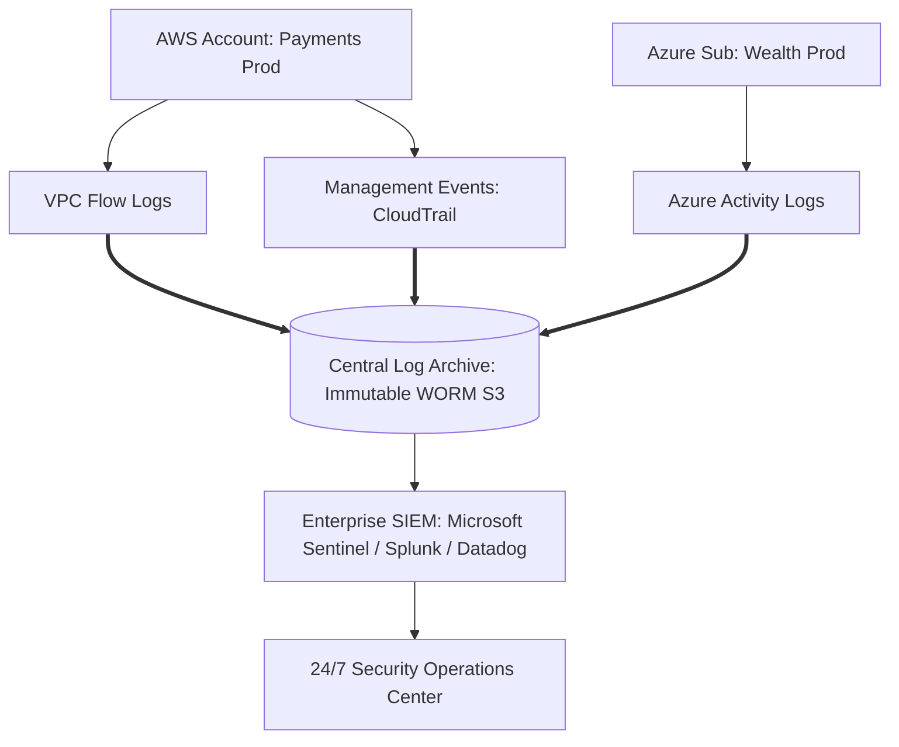

# Security Logging, SIEM Integration & Threat Detection

## Executive Summary

Security observability requires centralized aggregation, real-time threat detection, and immutable archiving of all control plane management events and network flow logs.

---

## 1. Centralized Security Telemetry Pipeline

---

## 2. Architectural Guardrails

- **Immutable Log Storage (WORM)**: Security audit logs must be routed to a dedicated, isolated Log Archive account protected by **Object Lock in Compliance Mode** with MFA Delete enabled. Even root administrators cannot alter or delete security logs.
- **AI-Driven Threat Detection**: Enable cloud-native anomaly detection engines (AWS GuardDuty, Microsoft Defender for Cloud) that analyze DNS queries, flow logs, and IAM calls for signs of credential compromise, cryptocurrency mining, or port scanning.
