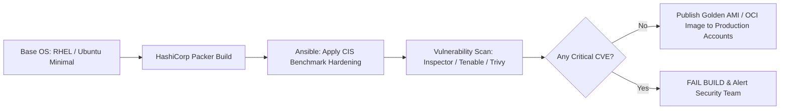

# Cloud Vulnerability Management & Golden Image Pipelines

## Executive Summary

Enterprise vulnerability management requires continuous, automated discovery and remediation of Common Vulnerabilities and Exposures (CVEs) across virtual machine images (AMIs) and container images.

---

## 1. Automated Golden Image Baking Pipeline

---

## 2. Continuous Production Scanning

- **Agentless Scanning**: Deploy modern agentless CSPM scanners (e.g., Wiz, Orca) that inspect EBS/Disk snapshots out-of-band via cloud APIs, identifying vulnerabilities and secrets without installing intrusive agents on production hosts.
- **Automated Fleet Recycling**: Rotate production worker nodes and VMSS instances every 14 to 30 days using the latest patched golden images, eliminating long-lived configuration drift.
