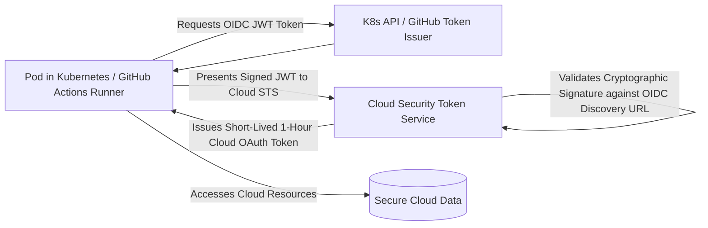

# Workload Identity: Eliminating Long-Lived Credentials

## Executive Summary

Long-lived machine credentials (AWS IAM access keys, Azure service principal secrets, GCP service account JSON keys) are the leading cause of enterprise cloud security breaches when accidentally committed to Git repositories.

---

## 1. OIDC Federated Workload Identity Architecture

---

## 2. Workload Identity Implementations

- **AWS EKS Pod Identity**: Maps Kubernetes Service Accounts directly to IAM roles without managing manual OIDC trust policies.
- **Azure Workload Identity**: Associates Kubernetes Service Accounts with Entra ID Managed Identities using OIDC federated credentials.
- **GCP Workload Identity Federation**: Enables external workloads (GitHub Actions, AWS, on-prem) to impersonate GCP service accounts without downloaded JSON keys.
