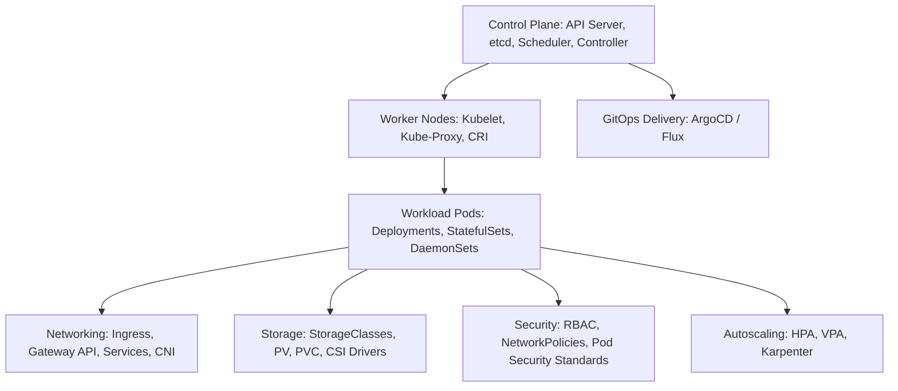

# Enterprise Kubernetes Architecture

## Executive Summary

Kubernetes (K8s) is the de facto industry standard for orchestrating containerized workloads across heterogeneous infrastructure. However, Kubernetes introduces **immense operational complexity, rapid version deprecation cycles, and severe cognitive load**. 

This section provides production-grade architectural blueprints, governance frameworks, and crucially—a clear framework for **when NOT to use Kubernetes**.

---

## Kubernetes Architecture Map

---

## Deliverables & Guides

| Document | Focus Area | Architectural Impact |
| :--- | :--- | :--- |
| **[Architecture Internals](architecture.md)** | Control Plane & Worker internals | kube-apiserver, etcd quorum, controller-manager, scheduler |
| **[Workload Resources](workload-resources.md)** | Core resource abstractions | Deployments, StatefulSets, DaemonSets, Jobs, CronJobs |
| **[Networking & Services](networking-and-services.md)** | Internal & External networking | ClusterIP, Headless, Ingress, Gateway API, CoreDNS |
| **[Config & Secrets](configuration-and-secrets.md)** | Configuration decoupling | ConfigMaps, External Secrets Operator, CSI Secret Store |
| **[Storage Architecture](storage-architecture.md)** | Stateful storage design | PV, PVC, StorageClasses, dynamic provisioning, access modes |
| **[Scheduling & Placement](scheduling-and-placement.md)** | Workload placement | Taints/tolerations, node affinity, topology spread constraints |
| **[Autoscaling Architecture](autoscaling.md)** | Multi-tier scaling | Horizontal Pod Autoscaler (HPA), KEDA, Karpenter |
| **[Security & RBAC](security-and-rbac.md)** | Multi-tenant cluster hardening | Least privilege RBAC, NetworkPolicies, Pod Security Standards |
| **[Operators & Extensibility](extensibility-and-operators.md)**| Extending the K8s API | Custom Resource Definitions (CRDs), Operator pattern |
| **[GitOps Delivery](gitops-delivery.md)** | Declarative reconciliation | ArgoCD, Flux, pull-based delivery, repo structure |
| **[Multi-Cluster Architecture](multi-cluster-architecture.md)**| Fleet management | Multi-cluster topologies, service meshes, cross-cluster failover |
| **[Cluster Upgrades & DR](cluster-upgrades-and-dr.md)** | Lifecycle & Business Continuity | In-place vs Blue/Green cluster upgrades, Velero backup |
| **[Observability](observability.md)** | Telemetry engineering | Prometheus Operator, kube-state-metrics, OpenTelemetry |
| **[When NOT to Use Kubernetes](when-not-to-use-kubernetes.md)**| Over-engineering prevention | The operational tax of K8s; simpler, superior alternatives |
| **[K8s Adoption Decision Framework](kubernetes-adoption-decision-framework.md)**| Measurable adoption framework| Quantitative scorecard determining whether to adopt Kubernetes |
