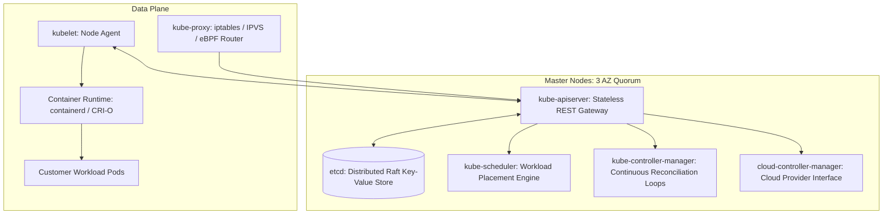

# Kubernetes Architecture & Control Plane Internals

## Executive Summary

Kubernetes is built on a distributed control plane that reconciles the **desired state** declared in YAML against the **actual state** running across worker nodes.

---

## 1. Control Plane & Data Plane Topology

---

## 2. The Heart of Kubernetes: etcd Consistency

1. **Raft Consensus**: etcd requires a strict odd-numbered quorum ($2N + 1$, typically 3 or 5 nodes). A 3-node cluster survives the failure of 1 node; a 5-node cluster survives 2.
2. **Disk I/O Latency Sensitivity**: etcd is extremely sensitive to disk fsync latency. Running etcd on slow, shared, or burstable block storage causes Raft heartbeat timeouts, triggering leader election storms that freeze the entire cluster API.
3. **Stateless API Server**: The `kube-apiserver` maintains zero local state. It acts as an authenticated JSON gatekeeper, validating schemas, executing admission webhooks, and writing directly to etcd.
