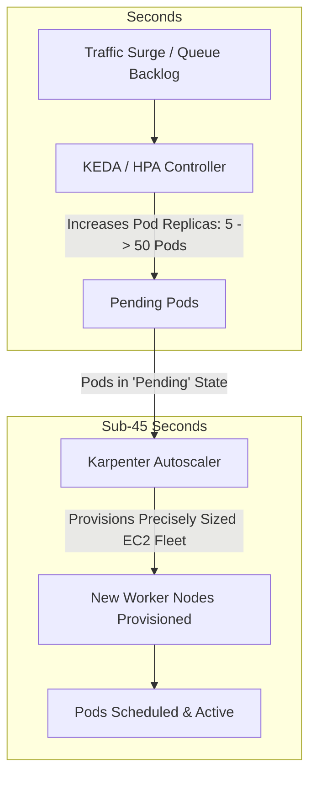

# Kubernetes Autoscaling Architecture: HPA, KEDA & Karpenter

## Executive Summary

Kubernetes autoscaling operates across two distinct layers: **Workload Scaling** (increasing pod counts) and **Node Scaling** (increasing physical/virtual server infrastructure).

---

## 1. Two-Tier Autoscaling Architecture

---

## 2. The Karpenter Revolution (Deprecating Cluster Autoscaler)

- **Legacy Cluster Autoscaler**: Tied to rigid cloud Auto Scaling Groups (ASGs). Scaling up requires triggering ASG resizing, waiting for nodes to boot, and hoping the ASG instance type fits the pending pods (2–5 minutes).
- **Karpenter**: Bypasses Auto Scaling Groups. Karpenter evaluates the exact CPU, memory, and architecture requirements of pending pods and directly calls the cloud provider fleet API to instantiate the most cost-effective mix of spot, on-demand, Graviton, and x86 instances in **sub-45 seconds**.
