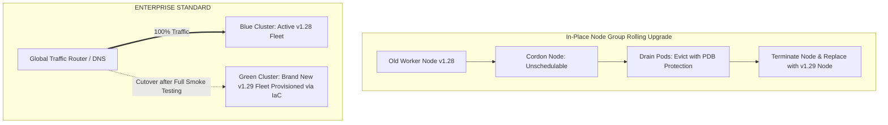

# Kubernetes Cluster Lifecycle, Upgrades & Disaster Recovery

## Executive Summary

Kubernetes releases minor versions every four months, supporting each release for only 14 months. Cluster lifecycle management and disaster recovery must be engineered as continuous, automated processes.

---

## 1. In-Place vs Blue/Green Cluster Upgrades

---

## 2. Disaster Recovery via Velero & GitOps

- **GitOps State Recovery**: In modern clusters, 95% of state is declarative YAML in Git. If a cluster is destroyed, re-applying GitOps manifests reconstructs the entire cluster topology in under 15 minutes.
- **Stateful PV Backup via Velero**: For clusters hosting persistent state, schedule **Velero** backups to take hourly volume snapshots and upload cluster metadata to remote cloud object storage.
