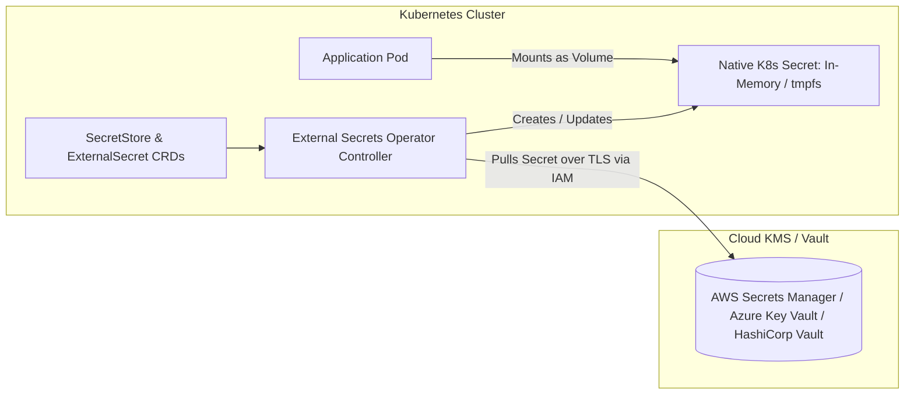

# Kubernetes Configuration & Secrets Architecture

## Executive Summary

Managing configuration and credentials in Kubernetes requires strict separation between application code and runtime environments. Plaintext Kubernetes Secrets (`base64` encoded) are **not secure by default**.

---

## 1. Modern Secret Management via External Secrets Operator (ESO)

---

## 2. Architectural Guardrails

1. **Never Commit Secrets to Git**: Storing base64-encoded strings in Git repositories is an immediate critical vulnerability. Store secrets strictly in managed cloud vaults.
2. **Rotate Secrets Automatically**: Use ESO synchronization intervals (`refreshInterval: "1h"`) to pull updated database credentials and trigger automated rolling restarts of consuming pods.
3. **Avoid Environment Variables for High-Entropy Secrets**: Mounting secrets as environment variables (`envFrom`) risks leaking credentials in crash dumps, `/proc` dumps, and child process inheritance. **Mount secrets strictly as ephemeral in-memory files via volumes.**
