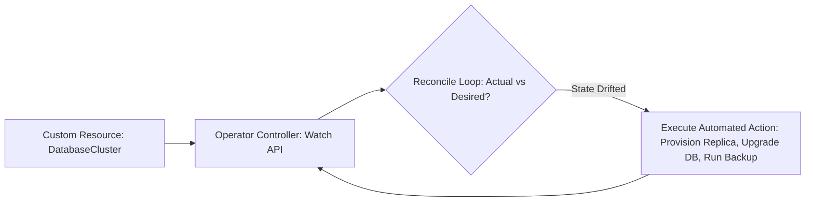

# Kubernetes Extensibility & The Operator Pattern

## Executive Summary

The **Operator Pattern** extends the Kubernetes API by pairing **Custom Resource Definitions (CRDs)** with a custom controller executing domain-specific operational logic.

---

## 1. The Operator Reconciliation Loop

---

## 2. When to Build an Operator vs Use Helm

- **Use Helm / Kustomize**: For deploying static applications, microservices, and web portals whose deployment involves simply templating Deployments, Services, and Ingress manifests.
- **Build / Adopt an Operator**: For complex stateful applications requiring automated operational domain knowledge:
  - Automating database failover and leader election (e.g., Crunchy Data PostgreSQL Operator, Strimzi Kafka Operator).
  - Automating zero-downtime rolling upgrades of complex quorum systems.
  - Automating scheduled snapshotting and point-in-time recovery.
