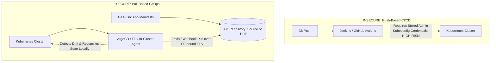

# GitOps Delivery Architecture: ArgoCD and Flux

## Executive Summary

GitOps is the operational framework where the entire desired state of a Kubernetes cluster is declared in a version-controlled Git repository. An in-cluster reconciliation agent continuously synchronizes the cluster state with Git, **eliminating direct `kubectl` access for engineers**.

---

## 1. Push vs Pull-Based GitOps

---

## 2. Enterprise GitOps Repository Structure

Organize GitOps repositories into two distinct tiers:
1. **Application Source Repositories**: Contains code, unit tests, and Dockerfile. CI pipeline compiles code, runs scans, builds image, and issues a pull request updating the image tag in the Config Repo.
2. **Infrastructure / Config Repositories**: Contains Kustomize/Helm manifests structured by environment (`environments/dev`, `environments/staging`, `environments/prod`). ArgoCD monitors this repository exclusively.
