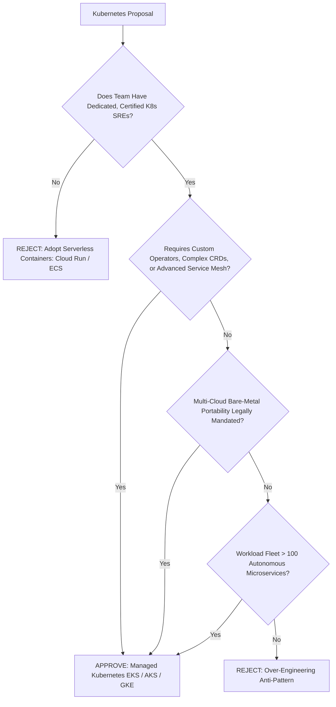

# Kubernetes Adoption Decision Framework

```yaml
status: approved
decision_type: framework
scope: enterprise-kubernetes-adoption
owners: architecture-review-board
review_cadence: semi-annual
```

## Executive Summary

This framework enforces a rigorous quantitative evaluation before any engineering group is authorized to provision a Kubernetes cluster.

---

## 1. The Kubernetes Gauntlet



---

## 2. Measurable Scoring Model

A proposal must achieve a score of **$\ge 70\%$** to receive ARB authorization for a new Kubernetes cluster:

| Criteria | Weight | Score 0 (Disqualifier) | Score 10 (Qualified) |
| :--- | :---: | :--- | :--- |
| **SRE Operational Maturity** | 30% | Zero production K8s experience; relies on developers to maintain clusters. | Dedicated 24/7 SRE rotation with CKA/CKS certifications. |
| **Workload Density** | 20% | $< 10$ services; small static traffic. | $> 100$ independent microservices with high horizontal scaling dynamics. |
| **Architectural Customization**| 20% | Standard HTTP APIs and basic background queues. | Complex custom operators, service mesh (Istio), or custom hardware drivers. |
| **Financial ROI** | 15% | Infrastructure savings are offset by hiring one additional SRE. | Fleet scale ($> 1,000\text{ vCPUs}$) yields $> \$300,000/\text{year}$ savings via binpacking. |
| **PaaS Exhaustion** | 15% | Team has not evaluated Cloud Run, ECS, or Container Apps. | Workload formally evaluated and proven incompatible with serverless containers. |
