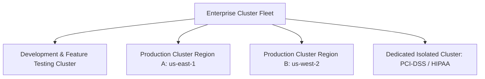

# Kubernetes Multi-Cluster Architecture & Fleet Management

## Executive Summary

At enterprise scale, running a single monolithic Kubernetes cluster for an entire organization creates a catastrophic blast radius. Enterprise architecture mandates **Multi-Cluster Fleets**.

---

## 1. Multi-Cluster Topology Models

---

## 2. Multi-Cluster Tenancy Strategy

| Strategy | Advantages | Disadvantages | Enterprise Recommendation |
| :--- | :--- | :--- | :--- |
| **Soft Multi-Tenancy (Namespaces in 1 Giant Cluster)**| Maximum resource binpacking; lowest infrastructure cost. | Massive blast radius; shared kernel; noisy neighbor risks; complex RBAC. | Dev/Test environments only. |
| **Hard Multi-Tenancy (Dedicated Physical Clusters)** | Complete blast radius isolation; independent upgrade lifecycles; independent compliance audits. | Higher base infrastructure cost; management overhead across multiple clusters. | **Mandatory Standard for Production & Regulated Workloads.** |
