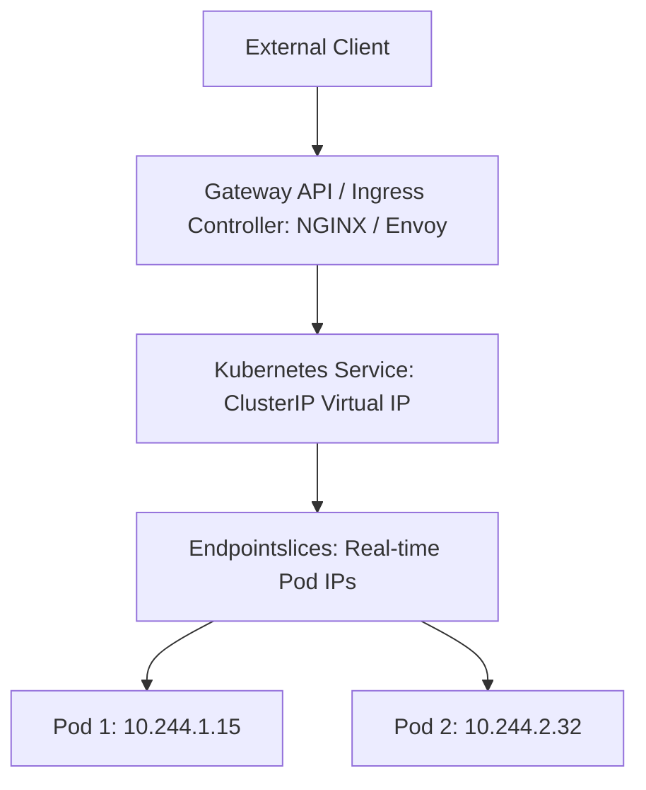

# Kubernetes Networking Architecture: Ingress, Gateway API & CNI

## Executive Summary

Kubernetes networking requires that every Pod receives a unique IP address and can communicate with every other Pod in the cluster without Network Address Translation (NAT).

---

## 1. Service Discovery & Traffic Routing

---

## 2. Ingress vs Gateway API

- **Ingress (Legacy)**: Limited to basic HTTP/HTTPS path routing (`/api`). Annotations are non-standard and vendor-specific across controllers, breaking portability.
- **Gateway API (Modern Standard)**: Role-oriented API decoupling infrastructure provisioning (`GatewayClass`, `Gateway` owned by Platform Ops) from routing rules (`HTTPRoute`, `GRPCRoute` owned by Application Devs). Supports cross-namespace routing, canary traffic splitting, and native header modification without bespoke annotations.

---

## 3. CNI (Container Network Interface) Architecture

- **AWS VPC CNI**: Allocates native AWS VPC IP addresses directly to pods. Eliminates overlay encapsulation but risks VPC subnet IP exhaustion.
- **Cilium (eBPF)**: High-performance CNI that replaces legacy `iptables` and `kube-proxy` with native Linux **eBPF** programs, delivering microsecond packet routing and deep L7 security observability.
