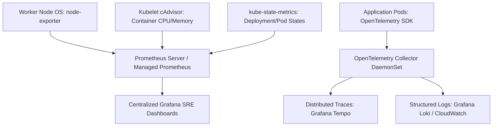

# Kubernetes Observability Architecture

## Executive Summary

Observability in Kubernetes requires monitoring four distinct layers: physical worker nodes, Kubernetes control plane components, pod lifecycle metrics, and application performance telemetry.

---

## 1. The Kubernetes Observability Stack

---

## 2. Pod Disruption Budgets (PDB) & SLO Monitoring

- **Pod Disruption Budgets (PDB)**: Enforce PDBs (`minAvailable: 2` or `maxUnavailable: 20%`) on all critical deployments. This guarantees that voluntary disruptions (node draining during upgrades, autoscaling scale-down) never breach application availability SLAs.
