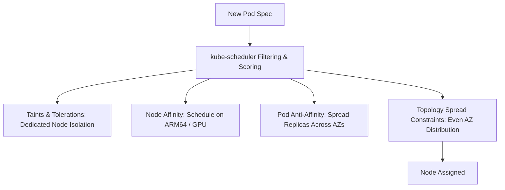

# Kubernetes Scheduling & Workload Placement Architecture

## Executive Summary

The `kube-scheduler` determines which worker node should host each newly created pod, balancing resource requests, physical topology, and high-availability constraints.

---

## 1. Advanced Placement Mechanisms



---

## 2. High-Availability Placement Rules

1. **Topology Spread Constraints (Replacing Pod Anti-Affinity)**:
   - Deprecate rigid `podAntiAffinity` which can cause scheduling bottlenecks. Enforce **Topology Spread Constraints** to guarantee that pod replicas are evenly distributed across Availability Zones:
   ```yaml
   topologySpreadConstraints:
     - maxSkew: 1
       topologyKey: topology.kubernetes.io/zone
       whenUnsatisfiable: DoNotSchedule
       labelSelector:
         matchLabels:
           app: payment-service
   ```
2. **Taints and Tolerations for Workload Isolation**:
   - Taint dedicated nodes (e.g., `workload=gpu:NoSchedule` or `compliance=pci:NoSchedule`) to prevent general enterprise microservices from consuming costly specialized hardware.
