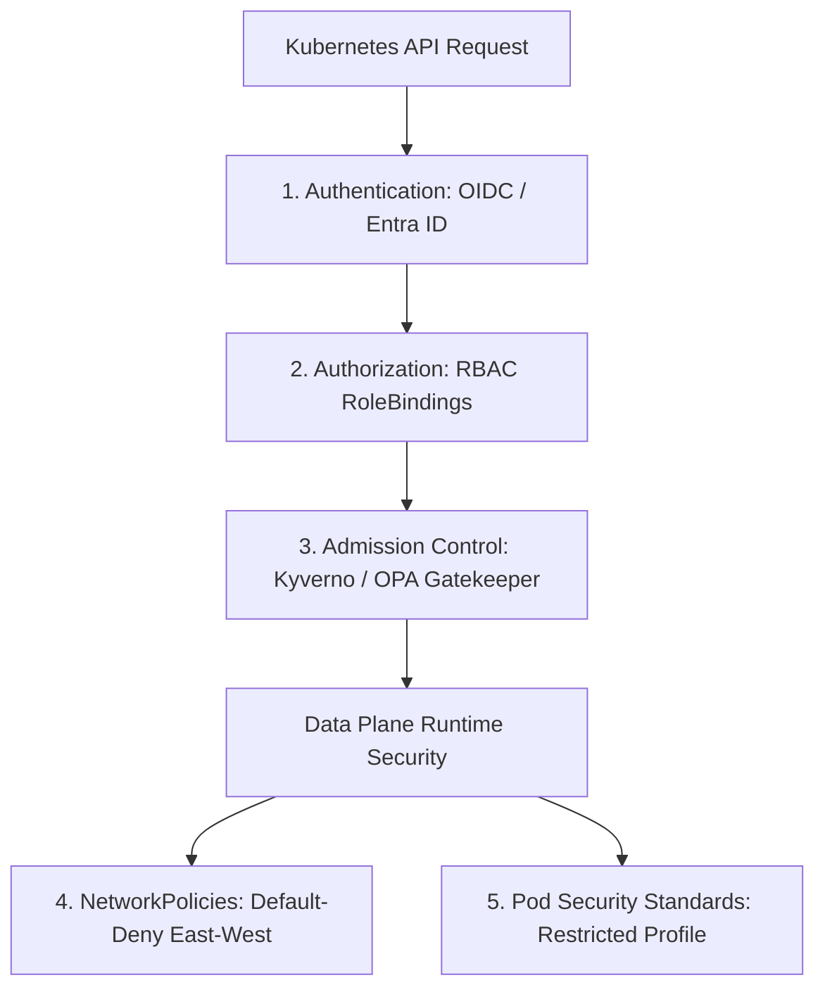

# Kubernetes Multi-Tenant Security & RBAC Hardening

## Executive Summary

Kubernetes was not originally designed for untrusted multi-tenancy. Hardening enterprise clusters requires a defense-in-depth architecture spanning **RBAC**, **NetworkPolicies**, and **Pod Security Standards**.

---

## 1. Defense-in-Depth Security Matrix

---

## 2. Non-Negotiable Hardening Baselines

1. **Default-Deny Network Policies**:
   - By default, Kubernetes networking is flat: any pod in any namespace can communicate with any other pod in any namespace.
   - Enforce a **Default-Deny Ingress and Egress NetworkPolicy** in every namespace, requiring application teams to explicitly whitelist authorized internal microservice communication paths.
2. **Pod Security Standards (Restricted Baseline)**:
   - Enforce the `restricted` Pod Security Standard across all production namespaces:
     - Disallow running as root (`runAsNonRoot: true`).
     - Disallow privilege escalation (`allowPrivilegeEscalation: false`).
     - Disallow host namespaces (`hostPID: false`, `hostNetwork: false`).
