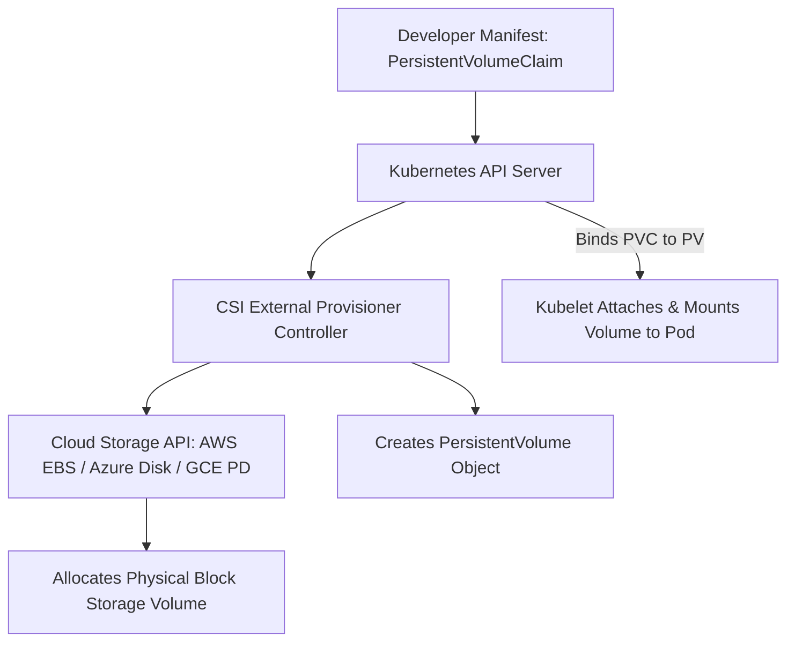

# Kubernetes Storage Architecture: CSI, PV & StorageClasses

## Executive Summary

The Container Storage Interface (CSI) abstracts cloud and on-premises storage systems behind standard Kubernetes API resources: **StorageClasses**, **PersistentVolumes (PV)**, and **PersistentVolumeClaims (PVC)**.

---

## 1. Dynamic Storage Provisioning Flow

---

## 2. Access Modes & Cloud Limitations

| Access Mode | Description | Supported Storage Types | Cloud Block Storage Reality |
| :--- | :--- | :--- | :--- |
| **ReadWriteOnce (RWO)**| Mounted by a single node for read/write | AWS EBS, Azure Disk, GCP Persistent Disk | **Strictly locked to a single AZ**. A pod rescheduled in AZ2 cannot mount an EBS volume created in AZ1! |
| **ReadOnlyMany (ROX)** | Mounted by multiple nodes for read-only | AWS EFS, Azure Files, NFS, Ceph | Suitable for shared static configuration or ML models |
| **ReadWriteMany (RWX)**| Mounted by multiple nodes for concurrent read/write | Distributed Network Filesystems (NFS, EFS, Azure Files) | File-locking contention; sub-optimal for high-IOPS relational databases |
