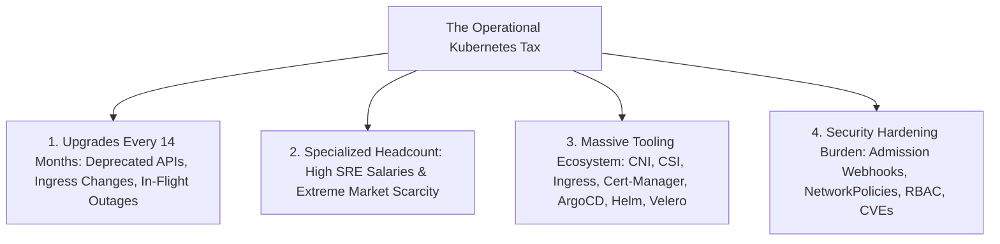

# When NOT to Use Kubernetes: The Operational Reality

## Executive Summary

> **Kubernetes is the premier platform for solving distributed systems problems that 85% of enterprises do not actually have.**

Adopting Kubernetes prematurely is one of the most common causes of engineering velocity collapse. This document establishes when Kubernetes is **architecturally contraindicated**.

---

## 1. The Hidden "Kubernetes Tax"

---

## 2. Architectural Red Flags: When NOT to Use Kubernetes

| Scenario / Characteristic | Why Kubernetes is the WRONG Choice | Superior Alternative Architecture |
| :--- | :--- | :--- |
| **Small Engineering Team ($< 15$ Developers)** | Managing Kubernetes infrastructure consumes $30 - 50\%$ of total engineering capacity. | **Serverless Containers (Google Cloud Run / AWS ECS + Fargate / Azure Container Apps)**. |
| **Standard Web APIs & Microservices** | If applications communicate via standard HTTP REST/gRPC and store state in managed databases, Kubernetes scheduling provides zero unique value. | **Managed App Services (Azure App Service / AWS App Runner / Cloud Run)**. |
| **Monolithic Applications** | Packing a legacy stateful monolith into a single massive Kubernetes pod adds network abstraction layers with zero scaling benefit. | **Standard Virtual Machines (EC2 / Azure VMSS) with Autoscaling Groups**. |
| **Low-Volume / Bursty Batch Workloads** | Keeping worker nodes running 24/7 incurs high baseline costs. | **Serverless FaaS (AWS Lambda / Cloud Functions / AWS Batch)**. |
| **No Dedicated 24/7 Platform/SRE Team** | When a production etcd cluster corrupts or a CNI plugin deadlocks at 3 AM, standard software engineers cannot debug the cluster. | **Fully Managed Serverless PaaS**. |
