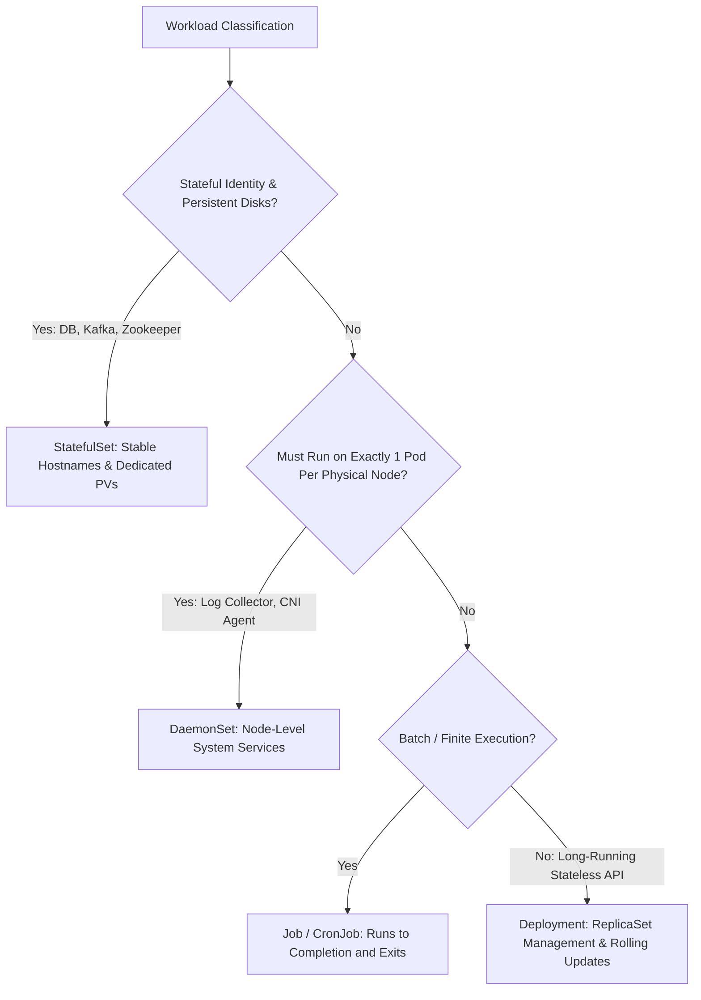

# Kubernetes Workload Architecture: Deployments, StatefulSets & DaemonSets

## Executive Summary

Workloads must be mapped to the appropriate Kubernetes workload controller based on statefulness, scheduling topology, and execution lifespan.

---

## 1. Controller Selection Matrix

---

## 2. StatefulSets vs Deployments for Data Stores

| Feature | Deployment | StatefulSet |
| :--- | :--- | :--- |
| **Pod Identity** | Random, ephemeral hash names (`order-api-7b8f9c-4x2lz`) | Deterministic, zero-indexed names (`kafka-0`, `kafka-1`, `kafka-2`) |
| **DNS Hostname** | Shared service ClusterIP | Dedicated stable network identity via Headless Service |
| **Storage Binding** | Shared volume or ephemeral storage | Dedicated PersistentVolumeClaim per pod ordinal index (`volumeClaimTemplates`) |
| **Startup / Scaling**| Concurrent parallel startup | Sequential, ordered startup ($0 \rightarrow 1 \rightarrow 2$) and teardown ($2 \rightarrow 1 \rightarrow 0$) |
