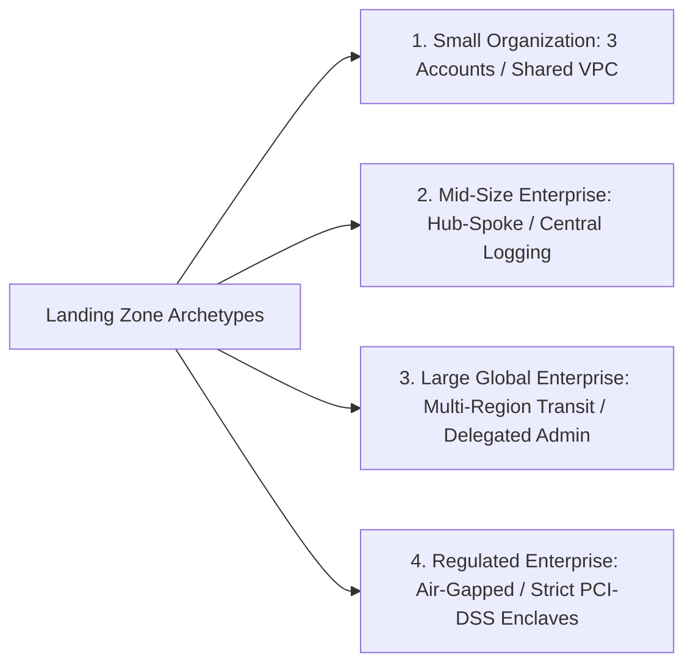

# Enterprise Cloud Landing Zones Architecture

## Executive Summary

A Cloud Landing Zone is a fully automated, multi-account, well-architected foundation providing identity, security, logging, networking, and governance baselines upon which enterprise workloads are safely deployed.

---

## Landing Zone Archetypes

---

## Deliverables & Guides

| Document | Focus Area | Architectural Impact |
| :--- | :--- | :--- |
| **[Small Organization Blueprint](small-organization.md)** | Startups & small IT | 2–3 accounts, shared networking, basic guardrails |
| **[Mid-Size Enterprise Blueprint](mid-size-enterprise.md)** | Growth & scaling firms | Hub-and-spoke networking, dedicated security/logging accounts |
| **[Large Enterprise Blueprint](large-enterprise.md)** | Global Fortune 500 | Multi-region transit hubs, delegated administration, central egress |
| **[Regulated Enterprise Blueprint](regulated-enterprise.md)** | BFSI & Healthcare | Air-gapped immutable logging, dedicated PCI/HIPAA enclaves, HSMs |
