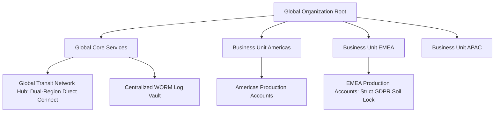

# Large Global Enterprise Landing Zone Blueprint (50-200+ Accounts)

## Executive Summary

Designed for Fortune 500 global multinationals operating across multiple geographic business units and regions.

---

## 1. Global Multi-Account Mesh Architecture

---

## 2. Advanced Architectural Features
- **Delegated Administration**: Move administrative services (GuardDuty, AWS Organizations management) to dedicated member accounts, keeping the Root Organization Account completely locked and dormant.
- **Centralized Inspection Egress**: All internet egress across 100+ accounts routes through central Next-Gen Firewall inspection hubs.
