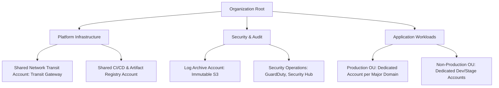

# Mid-Size Enterprise Landing Zone Blueprint (8-15 Accounts)

## Executive Summary

Designed for mid-market enterprises ($100 - 500$ engineers) requiring clear segregation of duties.

---

## 1. Account Topology

