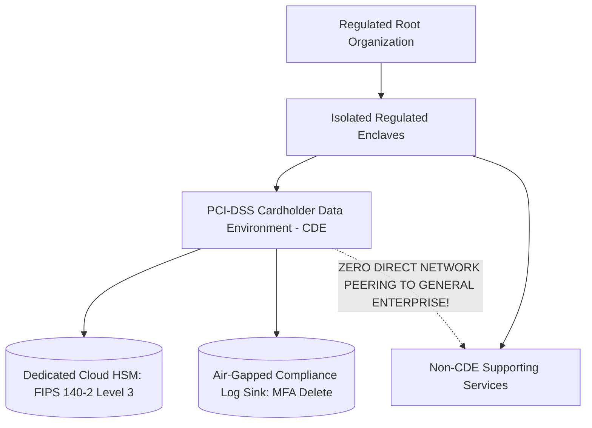

# Regulated Enterprise Landing Zone Blueprint (BFSI / Healthcare)

## Executive Summary

Engineered specifically for central banks, payment processors (PCI-DSS Level 1), healthcare entities (HIPAA), and defense contractors (FedRAMP).

---

## 1. Regulated Enclave Isolation Architecture

---

## 2. Non-Negotiable Compliance Invariants
1. **Physical Dedicated Hardware**: Enforce AWS Dedicated Instances or Azure Dedicated Hosts where hypervisor multi-tenancy is prohibited by regulators.
2. **Customer Managed HSM**: Master cryptographic keys reside in physical dedicated hardware modules owned and operated exclusively by the enterprise.
3. **Air-Gapped Audit Log Archiving**: Security logs are cross-replicated to a dedicated compliance account with no interactive administrative login capabilities.
