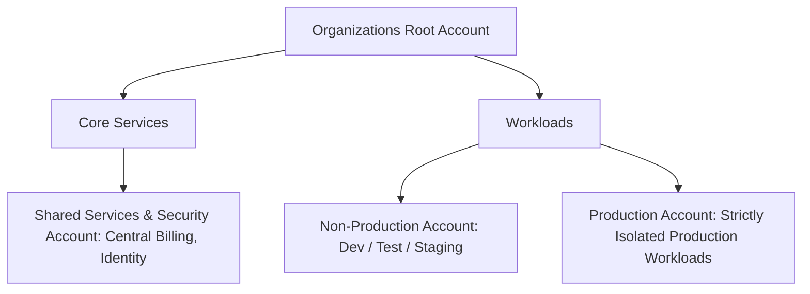

# Small Organization Landing Zone Blueprint (3 Accounts)

## Executive Summary

Designed for startups, independent business units, or small IT departments ($< 25$ engineers).

---

## 1. Account Topology

---

## 2. Core Guardrails
- Single transit VPC with environment-isolated subnets.
- Shared AWS IAM Identity Center or Entra ID directory.
- Centralized billing with automated budget threshold alarms.
