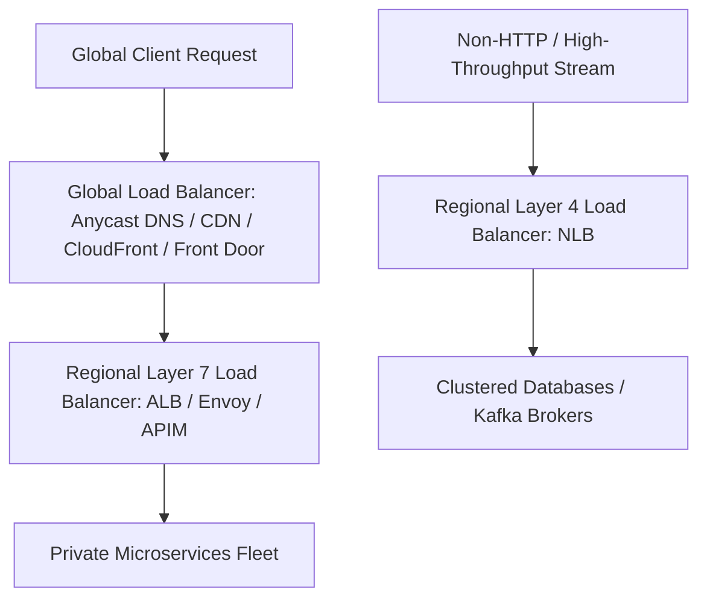

# Enterprise Load Balancing Architecture

## Executive Summary

Load balancers distribute incoming application and network traffic across a fleet of backend targets, providing high availability, fault tolerance, and automated traffic shaping.

---

## Load Balancing Hierarchy

---

## Deliverables & Guides

| Document | Focus Area | Architectural Impact |
| :--- | :--- | :--- |
| **[Layer 4 vs Layer 7](layer4-vs-layer7.md)** | Transport vs Application LB | NLB vs ALB; TCP pass-through vs HTTP/gRPC termination |
| **[Global vs Regional](global-vs-regional.md)** | Geographic traffic management | Anycast IP routing vs DNS latency routing; failover |
| **[Internal Load Balancing](internal-load-balancing.md)** | Private microservice routing | Internal ALBs, Private DNS discovery, avoiding Hairpin NAT |
| **[Health Checking & Draining](health-checking-and-draining.md)** | Connection lifecycle | Health check algorithms, deregistration delay, graceful drain |
| **[Session Affinity](session-affinity.md)** | Sticky sessions | Cookie affinity mechanics and why it breaks horizontal scaling |
| **[TLS Termination & mTLS](tls-termination-and-mtls.md)** | Encryption offloading | SNI multi-domain certificates, backend re-encryption, mTLS |
| **[Traffic Splitting & Routing](traffic-splitting-and-routing.md)** | Advanced traffic control | Weighted routing, header-based routing, Canary and Blue/Green |
