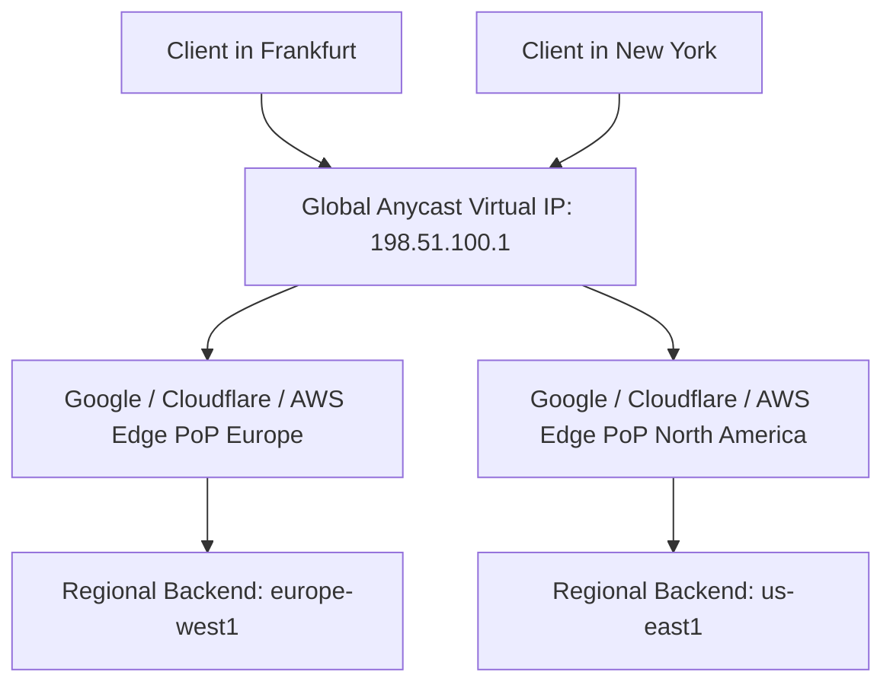

# Global vs Regional Load Balancing Architecture

## Executive Summary

Global load balancing directs traffic across multiple geographic regions, while regional load balancing distributes traffic across availability zones within a single region.

---

## 1. Global Anycast Routing Architecture

---

## 2. DNS-Based vs Anycast Global Routing

- **DNS-Based Routing (AWS Route 53 / Azure Traffic Manager)**: Relies on client DNS resolvers obeying TTLs. When a region fails, cached DNS records at recursive resolvers delay failover by minutes or hours.
- **Anycast IP Routing (Google Global LB / AWS Global Accelerator / Cloudflare)**: A single IP address is announced via BGP from hundreds of edge locations simultaneously. If a region fails, edge routers redirect TCP packets to the next closest healthy region in **sub-second timeframes without waiting for DNS propagation**.
