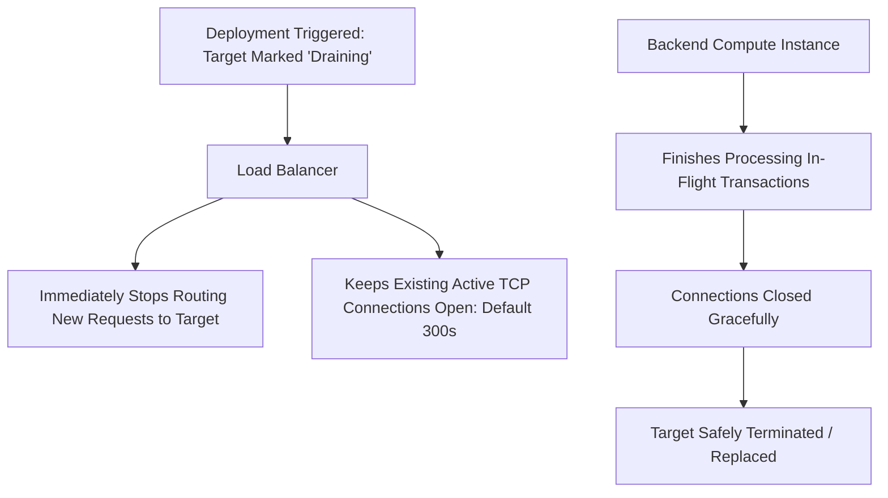

# Health Checking & Connection Draining Architecture

## Executive Summary

Properly configured health checking and connection draining are the prerequisites for zero-downtime rolling deployments and automated fault isolation.

---

## 1. Connection Draining (Deregistration Delay) Mechanics



---

## 2. Production Health Check Tuning Parameters

```yaml
health_check:
  path: "/healthz"
  port: "traffic-port"
  protocol: "HTTP"
  interval_seconds: 10          # Check frequency
  timeout_seconds: 5            # Max response wait
  healthy_threshold_count: 2    # Consecutive passes to mark HEALTHY
  unhealthy_threshold_count: 3  # Consecutive fails to mark UNHEALTHY
```

> **Calculation: Failure Detection Time Window**:
> $$\text{Detection Window} = \text{Interval} \times \text{Unhealthy Threshold} = 10\text{ s} \times 3 = 30\text{ seconds}$$
> Tuning this interval too aggressively ($< 2\text{ s}$) causes transient CPU spikes to trigger false-positive failovers; tuning it too high ($> 60\text{ s}$) leaves users routing to dead instances for minutes.
