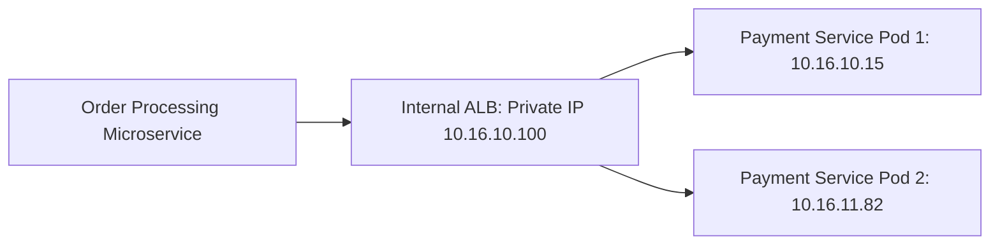

# Internal Load Balancing & Private Service Discovery

## Executive Summary

Internal Load Balancers (ILBs) provide high-availability endpoints for private microservices residing within private subnets, shielding backend compute instances from direct peer-to-peer coupling.

---

## 1. Internal Load Balancing Topology

---

## 2. The Hairpin NAT Trap & Resolution

- **The Problem (Hairpinning)**: If Service A resides on Worker Node 1 and calls Service B through a public load balancer or external DNS name, the packet leaves the VPC, gets NAT'd, and loops back into the same host. This incurs latency penalties and data transfer charges.
- **The Architecture Standard**: All east-west microservice communication must route through **Internal Load Balancers mapped to Private DNS Hosted Zones** (e.g., `payment.internal.corp`) or in-cluster service discovery (Kubernetes CoreDNS).
