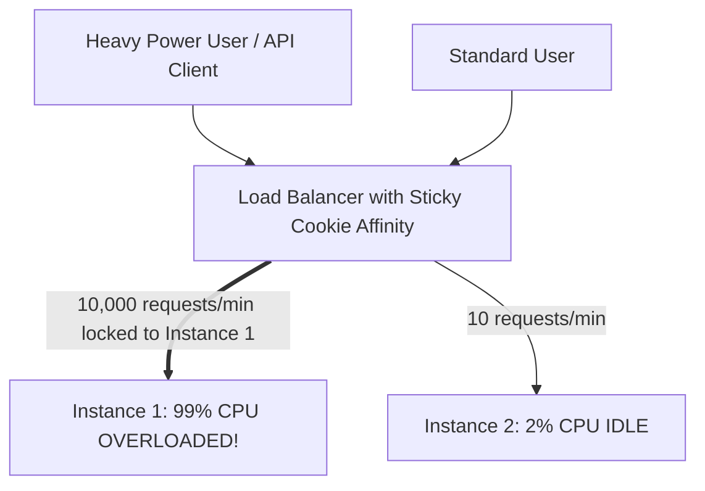

# Session Affinity (Sticky Sessions) & Scalability Impacts

## Executive Summary

Session affinity binds a client's requests to a specific physical backend instance for the duration of their session. While simple to enable, **session affinity is an architectural anti-pattern for horizontally scalable systems**.

---

## 1. How Sticky Sessions Break Horizontal Scaling

---

## 2. The Architectural Alternative: Externalized Stateless Sessions

1. **The Flaws of Stickiness**:
   - If Target 1 crashes or scales down, all sessions bound to it are dropped, corrupting shopping carts or user state.
   - Autoscaling fails because traffic cannot be redistributed away from overloaded nodes.
2. **The Modern Standard**:
   - Applications must remain **100% stateless**. Store user sessions in an external distributed cache (Redis / DynamoDB) indexed by a secure session token passed in the HTTP `Authorization` header. Any backend instance can serve any user request interchangeably.
