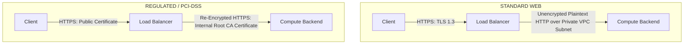

# TLS Termination, Offloading & Mutual TLS (mTLS)

## Executive Summary

Load balancers terminate incoming client SSL/TLS connections, offloading cryptographic handshakes from application compute nodes and enforcing modern cipher suites.

---

## 1. TLS Termination vs End-to-End Encryption

---

## 2. Mutual TLS (mTLS) at the Gateway

For zero-trust machine-to-machine APIs (e.g., Open Banking partner integrations), configure the load balancer for **mTLS (Mutual TLS)**:
- The load balancer requests and cryptographically verifies the client's X.509 certificate against an enterprise Trust Store (CA bundle) during the initial TLS handshake.
- Unauthenticated requests are dropped at the network boundary before reaching application code.
