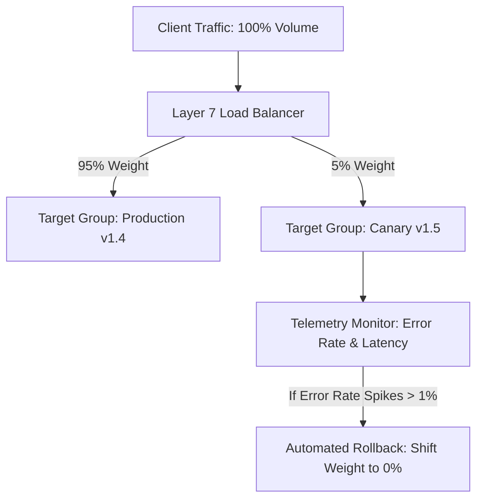

# Traffic Splitting & Advanced Routing Architecture

## Executive Summary

Modern Layer 7 load balancers support sophisticated traffic routing rules, enabling blue/green releases, canary rollouts, and A/B testing directly at the network layer.

---

## 1. Weighted Target Group Routing (Canary Rollouts)

---

## 2. Header and Query-Parameter Routing

- **Internal Beta Testers**: Route requests containing HTTP header `X-Environment: Beta` to a pre-release backend cluster while serving standard production traffic to all other users.
- **Mobile vs Desktop Routing**: Evaluate `User-Agent` headers to route traffic to optimized API rendering microservices.
