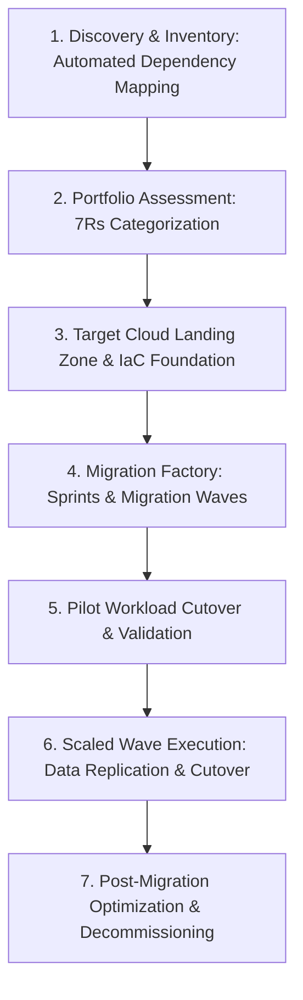

# Enterprise Cloud Migration Architecture

## Executive Summary

Migrating enterprise legacy systems to hyperscale cloud platforms requires disciplined methodology, dependency analysis, automated migration factories, and risk-managed cutovers.

---

## The Migration Factory Lifecycle

---

## Deliverables & Guides

| Document | Focus Area | Architectural Impact |
| :--- | :--- | :--- |
| **[The 7 Rs Framework](the-7-rs-framework.md)** | Migration taxonomy | Retire, Retain, Rehost, Relocate, Repurchase, Replatform, Refactor |
| **[Discovery & Assessment](discovery-and-assessment.md)** | Workload discovery | Application inventory, dependency mapping, data classification |
| **[Migration Factory & Waves](migration-factory-and-waves.md)** | Industrialized delivery | Wave planning, migration factory assembly line, pilot execution |
| **[Database Cloud Migration](database-cloud-migration.md)** | Stateful migration | CDC-based replication, DMS, schema conversion, zero-downtime cutover |
| **[Application Cloud Migration](application-cloud-migration.md)**| Compute migration | VM migration, containerization, Strangler Fig pattern |
| **[Cutover & Rollback](cutover-and-rollback.md)** | Cutover execution | Cutover windows, parallel runs, reverse replication, rollback runbooks |
| **[Migration Decision Framework](cloud-migration-decision-framework.md)**| Strategy selection | Quantitative scorecard determining the optimal R for each application |
