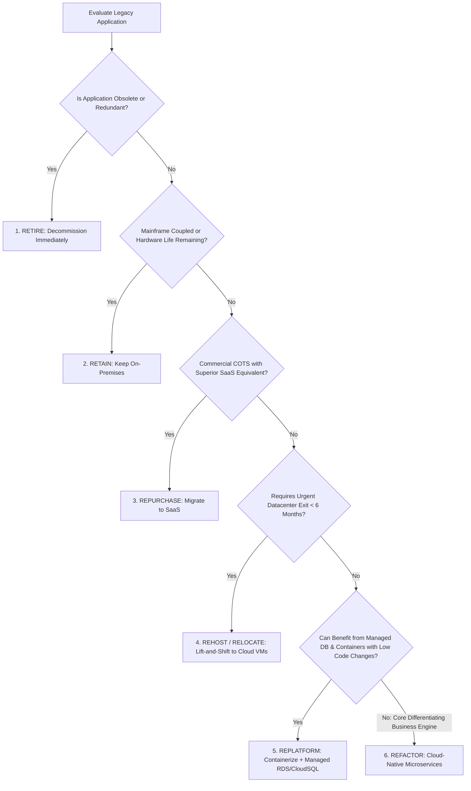

# Cloud Migration Decision Framework (The 7 Rs Scorecard)

```yaml
status: approved
decision_type: framework
scope: enterprise-cloud-migration
owners: architecture-review-board
review_cadence: semi-annual
```

## Executive Summary

This framework evaluates every candidate workload to assign the optimal migration strategy across the 7 Rs.

---

## 1. Decision Flowchart


