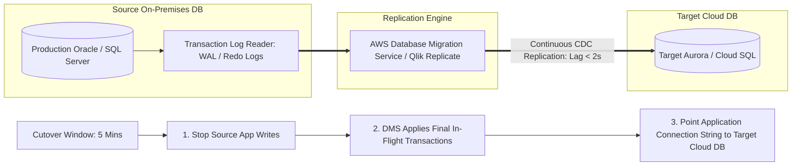

# Database Cloud Migration: Zero-Downtime Replication & Cutover

## Executive Summary

Migrating multi-terabyte transactional databases to managed cloud engines (PostgreSQL, Aurora, Azure SQL) without business downtime requires **Change Data Capture (CDC)** replication.

---

## 1. CDC-Driven Zero-Downtime Migration Architecture

---

## 2. The Reverse Replication Safety Net
- During cutover, immediately configure **Reverse CDC Replication** from the target cloud database back to the on-premises database.
- If an unexpected critical bug emerges 6 hours post-cutover, traffic can be failed back to on-premises with **zero data loss**, because every transaction executed in the cloud was replicated back to on-prem.
