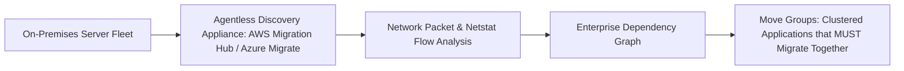

# Workload Discovery, Portfolio Assessment & Dependency Mapping

## Executive Summary

Migrating applications without understanding hidden network and database dependencies causes catastrophic post-migration outages.

---

## 1. Automated Dependency Discovery Architecture

---

## 2. Defining "Move Groups"
- If Application A executes 5,000 synchronous SQL queries per minute against Database B, they form a **Move Group**.
- Migrating Application A to the cloud while leaving Database B on-premises introduces a 30 ms WAN latency penalty per query, crashing Application A. Move Groups must migrate in the identical wave.
