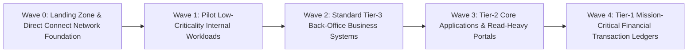

# The Migration Factory & Wave Planning Architecture

## Executive Summary

A **Migration Factory** is an industrialized delivery model that scales cloud migrations across hundreds of applications using standardized tooling, automation, and repeatable sprint cadences.

---

## 1. Migration Wave Sizing Blueprint

---

## 2. Migration Factory Assembly Line
1. **Assessment Pod**: Validates application readiness, secures IAM approvals, provisions target cloud accounts.
2. **Replication Pod**: Initiates block-level storage replication (AWS Application Migration Service - MGN) and database CDC sync.
3. **Validation Pod**: Executes automated smoke tests, performance benchmarks, and security compliance scans.
4. **Cutover Pod**: Coordinates DNS shifting, verifies data parity, and monitors post-cutover telemetry.
