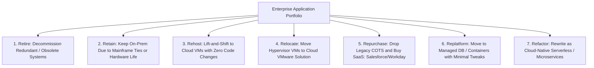

# The 7 Rs Cloud Migration Framework

## Executive Summary

The "7 Rs" categorize every enterprise application into a specific modernization and migration pathway.

---

## 1. The 7 Rs Taxonomy

---

## 2. Comparative Evaluation Matrix

| Strategy (The R) | Migration Speed | Upfront Cost | Modernization ROI | Technical Risk |
| :--- | :---: | :---: | :---: | :---: |
| **1. Retire** | **Immediate** | **$0 (Saves Money)** | **High (Eliminates Waste)**| **None** |
| **2. Retain** | N/A | $0 | Low | Low |
| **3. Rehost (Lift & Shift)**| **Fast (Weeks)** | Low | Low (Carries Technical Debt) | Low |
| **4. Relocate (VMware)** | Fast (Days) | Low | Low | Low |
| **5. Repurchase (SaaS)** | Moderate (Months)| Moderate | High (Zero Maintenance) | Moderate |
| **6. Replatform** | Moderate (Months)| Moderate | **High (Managed DB / Containers)**| Moderate |
| **7. Refactor (Cloud-Native)**| **Slow (6-18 Months)**| **High** | **Maximum (Agility & Elasticity)**| **High** |
