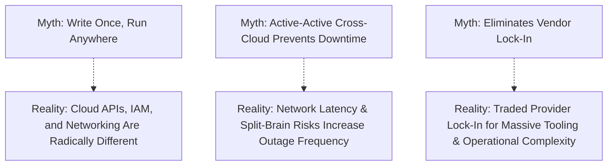

# Multi-Cloud Architecture: Reality, Myths, and Patterns

## Executive Summary

> **Multi-cloud is a business and risk decision, not automatically an architectural best practice.**

Deploying across multiple public cloud providers (e.g., AWS + Azure + GCP) is often promoted as a mechanism to prevent vendor lock-in and achieve 99.999% availability. In practice, poorly architected multi-cloud strategies result in **lowest-common-denominator engineering**, exponential operational complexity, fractured security boundaries, and massive egress bills.

---

## Multi-Cloud Realities vs Myths

---

## Core Deliverables & Guides

| Document | Focus Area | Architectural Impact |
| :--- | :--- | :--- |
| **[Architecture Reference](architecture.md)** | Valid multi-cloud topologies | Siloed clouds, Best-of-Breed, Primary/Secondary DR |
| **[Active-Active Multi-Cloud](active-active-multi-cloud.md)** | Distributed state across clouds | The mathematical impossibility of low-latency cross-cloud ACID |
| **[Active-Passive Multi-Cloud](active-passive-multi-cloud.md)** | Multi-cloud warm standby / pilot light| Asynchronous cross-cloud replication, DNS failover mechanisms |
| **[Multi-Cloud DR](multi-cloud-dr.md)** | Cross-cloud disaster recovery | Failover automation, data hydration, RTO/RPO reality |
| **[Data Portability](data-portability.md)** | Managing data across hyper-scalers | Egress fees, open table formats (Iceberg), cross-cloud replication |
| **[Application Portability](application-portability.md)** | Container and code portability | OCI containers, 12-factor design, anti-corruption SDK adapters |
| **[Kubernetes Portability](kubernetes-portability.md)** | The limits of K8s portability | Ingress differences, CSI storage classes, CNI networking |
| **[Terraform Portability](terraform-portability.md)** | The "write once" IaC myth | Why Terraform HCL cannot be copy-pasted between AWS and Azure |
| **[Cross-Cloud Networking & DNS](cross-cloud-networking-dns.md)**| Global connectivity and routing | Anycast DNS, Megaport/Equinix overlays, IP space planning |
| **[Cross-Cloud Observability](cross-cloud-observability.md)**| Unified telemetry pipelines | OpenTelemetry, central observability platforms, correlation |
| **[Multi-Cloud Decision Framework](multi-cloud-decision-framework.md)**| Business & risk evaluation framework| Rigorous criteria for approving or rejecting multi-cloud proposals |
