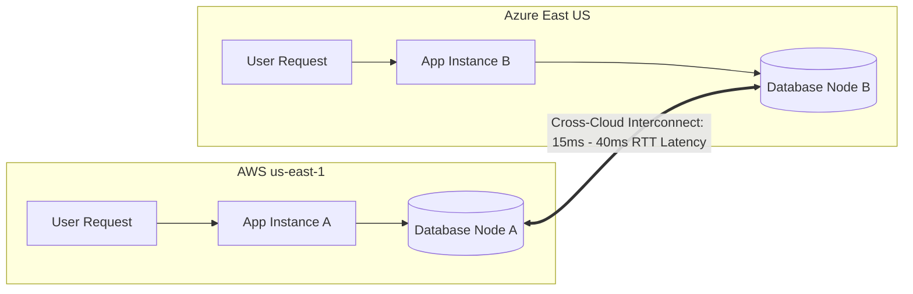

# Active-Active Multi-Cloud: The Distributed State Reality

## Executive Summary

Engineering teams frequently propose "Active-Active Multi-Cloud" under the belief that routing 50% of traffic to AWS and 50% to Azure ensures zero downtime. This document explains why active-active multi-cloud for transactional, stateful systems is **one of the most dangerous and costly anti-patterns in enterprise architecture**.

---

## 1. The Physics Problem: Speed of Light Across WAN

### The Mathematical Impossibility
1. **Intra-AZ Latency**: Sub-1 millisecond. Synchronous commits complete in $< 2\text{ ms}$.
2. **Cross-Cloud Latency**: Even with dedicated private interconnects (e.g., Megaport), cross-cloud round-trip time between AWS Virginia and Azure Virginia is $15 - 30\text{ ms}$.
3. **Synchronous Two-Phase Commit (2PC)**:
   - A single ACID transaction requires multiple round-trips for prepare and commit phases.
   - Total commit latency: $2 \times 30\text{ ms} = 60\text{ ms}$ minimum per write transaction.
   - Database connection pools exhaust rapidly under 1,000 writes/sec, causing systemic application thread starvation and cascading failure.

---

## 2. The Split-Brain Catastrophe

If the cross-cloud network link drops (due to BGP flaps or peering provider failure), an active-active cluster faces the CAP theorem dilemma:
- **Choose Consistency (CP)**: One or both cloud regions refuse to accept writes, causing the exact downtime the multi-cloud architecture was built to prevent.
- **Choose Availability (AP)**: Both clouds continue accepting writes independently, creating irreconcilable distributed state divergence (split-brain). Reconciling divergent financial or inventory ledgers post-partition requires weeks of manual data forensics.

> **Architecture Ruling**: Active-active multi-cloud is acceptable **only for pure stateless compute** caching static read-only data. It is **strictly prohibited for transactional ACID databases**.
