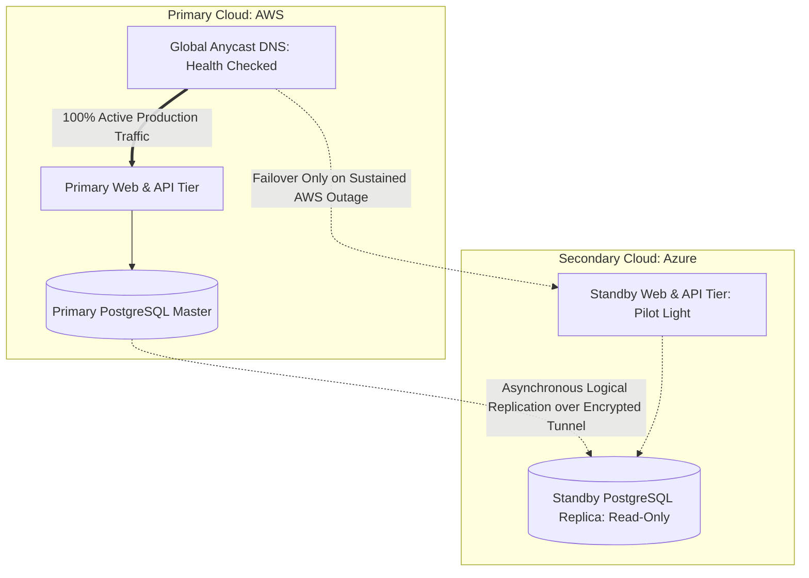

# Active-Passive Multi-Cloud Disaster Recovery

## Executive Summary

When regulatory requirements (such as European EBA banking guidelines) mandate cross-cloud disaster recovery, the only viable pattern for stateful systems is **Active-Passive Multi-Cloud** with asynchronous replication.

---

## 1. Active-Passive Architecture Topology

---

## 2. Operational Realities & Failover Protocol

1. **Accepting Asynchronous Data Loss (RPO > 0)**:
   - Because replication across clouds is asynchronous to protect primary write performance, there will always be replication lag ($500\text{ ms}$ to several seconds).
   - In a sudden catastrophic failure of the primary cloud, data committed in the last few seconds **will be lost**. Business stakeholders must formally approve this RPO via ADR.
2. **Manual Failover Gate (No Automated Flapping)**:
   - Never automate automated DNS failover between clouds based on a simple 30-second synthetic health check. Transient internet routing hiccups could trigger a premature cutover, causing split-brain.
   - Failover must require human confirmation by an Incident Commander following an established runbook.
