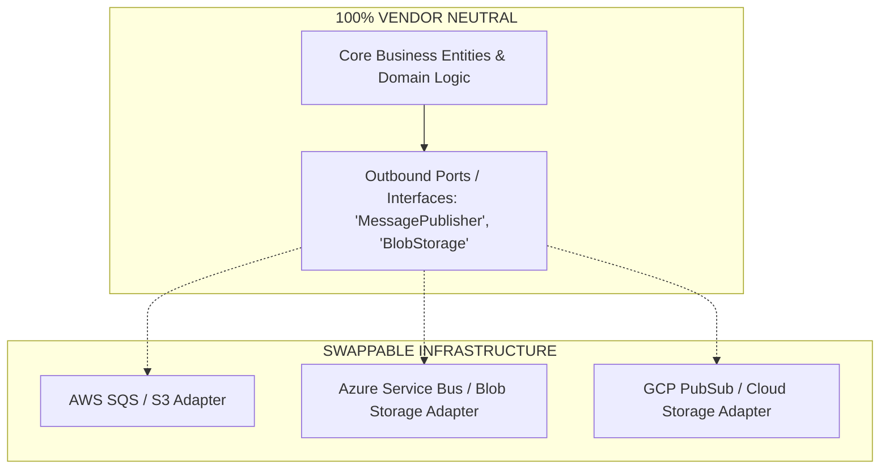

# Application Code Portability & Hexagonal Isolation

## Executive Summary

Application portability ensures that software source code can be compiled, containerized, and executed across multiple cloud providers or on-premises environments without rewriting core business logic.

---

## 1. Hexagonal Architecture for Cloud Portability

---

## 2. Portability Rules for Application Engineers

1. **Zero Cloud SDK Imports in Domain Code**:
   - Under no circumstances may application code import `com.amazonaws.*`, `com.azure.*`, or `com.google.cloud.*` in domain models, controllers, or business services.
   - All cloud SDK calls must reside entirely inside infrastructure adapter modules implementing clean domain interfaces.
2. **Twelve-Factor Configuration**:
   - Inject all configuration, connection strings, and feature toggles exclusively via environment variables or standardized configuration endpoints, never via proprietary cloud runtime metadata services.
3. **Standardized Open Telemetry Instrumentation**:
   - Instrument applications using vendor-neutral **OpenTelemetry SDKs**. Export telemetry over standard OTLP/gRPC to collectors, allowing telemetry backends to be swapped without modifying application code.
