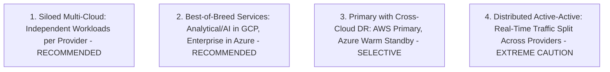

# Multi-Cloud Architectural Reference Topologies

## Executive Summary

There are four primary multi-cloud architectural topologies. Understanding which topology is being proposed is essential to evaluating its technical feasibility and operational risk.

---

## 1. The Four Multi-Cloud Topologies

### Comparative Analysis

| Multi-Cloud Topology | Description | Architectural Feasibility | Complexity Tax |
| :--- | :--- | :--- | :--- |
| **1. Siloed Multi-Cloud** | Workload A (e.g., Customer Portal) runs entirely in AWS; Workload B (e.g., Internal SAP) runs in Azure. No real-time cross-cloud runtime coupling. | **High (Standard Enterprise)**| Low: Standard single-cloud landing zones per business unit. |
| **2. Best-of-Breed Services**| Operational OLTP in AWS; Big Data & AI analytics in Google BigQuery/Vertex AI; Office/Identity in Azure Entra ID. Asynchronous batch data pipelines. | **High (Value-Driven)** | Moderate: Requires robust cross-cloud egress cost governance. |
| **3. Primary with Secondary DR**| AWS is active 24/7; Azure maintains a pilot light or warm standby database replica. Traffic cutover triggered only during total catastrophic provider failure. | **Moderate (Regulated Only)**| High: Maintaining identical IaC definitions and schema sync across two clouds. |
| **4. Distributed Active-Active**| Single application workload split 50/50 across AWS and GCP simultaneously with synchronous transactional state replication. | **PROHIBITED FOR OLTP** | Catastrophic: Latency penalties, distributed locks across WAN, split-brain failure modes. |
