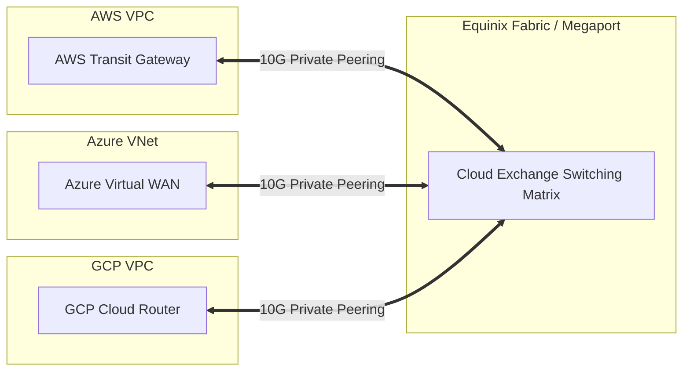

# Cross-Cloud Networking and DNS Routing

## Executive Summary

Connecting multiple cloud platforms requires an independent, carrier-grade network overlay and an Anycast DNS routing architecture that does not depend on the availability of any single cloud provider.

---

## 1. Cross-Cloud Network Overlay Architecture

---

## 2. Independent Anycast DNS Architecture

1. **Third-Party Authoritative DNS**:
   - If an enterprise uses AWS Route 53 as its sole authoritative DNS provider, an AWS global DNS outage renders the secondary Azure cloud inaccessible, invalidating the multi-cloud DR strategy.
   - Utilize a cloud-neutral, DDoS-protected Anycast DNS provider (e.g., **Cloudflare**, **Akamai Edge DNS**, or **NS1**) with automated health checking to route client traffic between cloud endpoints.
2. **Non-Overlapping IP Space Allocation**:
   - Enforce global IP governance across the entire corporate estate:
     - On-Premises: `10.0.0.0/12`
     - AWS Estate: `10.16.0.0/12`
     - Azure Estate: `10.32.0.0/12`
     - GCP Estate: `10.48.0.0/12`
