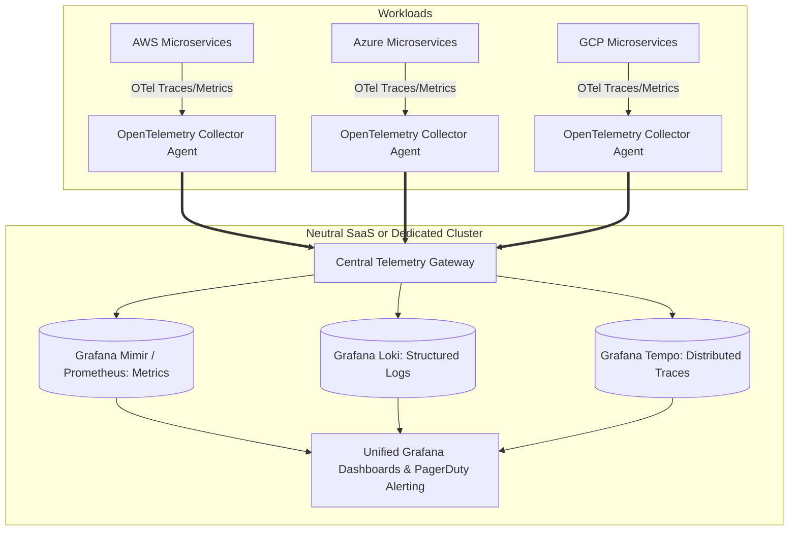

# Cross-Cloud Observability Architecture

## Executive Summary

Operating a multi-cloud environment without centralized telemetry creates operational blind spots. When an incident occurs, SREs cannot correlate traces and metrics across fragmented, cloud-proprietary monitoring silos (CloudWatch vs Azure Monitor vs Google Cloud Operations).

---

## 1. Unified Telemetry Architecture

---

## 2. Architectural Requirements

1. **Standardized Correlation IDs**:
   - Enforce W3C Trace Context headers (`traceparent`, `tracestate`) across all HTTP, gRPC, and messaging payloads. When a transaction traverses from AWS to Azure, the trace must remain continuous.
2. **Cardinality Management**:
   - In multi-cloud environments, resource labels must include `cloud.provider`, `cloud.region`, `cloud.account.id`, and `service.name`. Enforce strict metric relabeling rules at the collector level to prevent exploding time-series cardinality.
