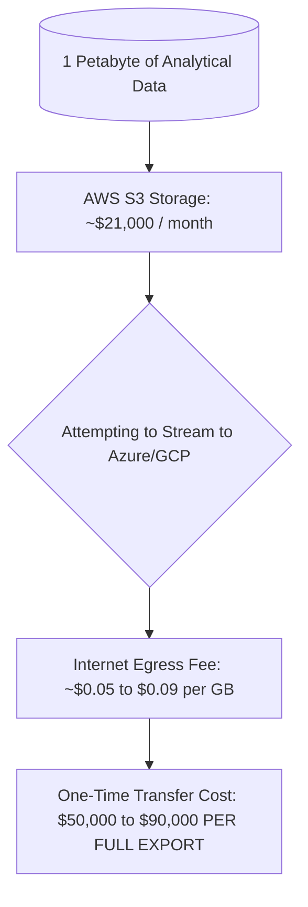

# Data Portability & Egress Architecture

## Executive Summary

Data has gravity. The cost and latency of moving petabytes of data out of a hyperscale cloud provider (egress fees) creates an economic moat that dwarfs code-level portability concerns.

---

## 1. The Economics of Data Gravity

---

## 2. Architectural Strategies for Data Portability

1. **Standardize on Open Table Formats**:
   - Store big data datasets in open, vendor-neutral formats such as **Apache Iceberg**, **Apache Hudi**, or **Delta Lake** with Apache Parquet underlying files.
   - This allows compute engines from any provider (AWS EMR, Google BigQuery, Snowflake, Databricks) to read the same physical files without proprietary ETL conversion.
2. **Neutral Interconnect Exchanges**:
   - For high-volume hybrid or multi-cloud data exchanges, connect via neutral cloud-adjacent colocation facilities (e.g., Equinix Metal) where high-speed fiber cross-connects bypass public internet egress penalties.
3. **Partitioned Storage Strategy**:
   - Maintain master raw immutable archives in cost-effective multi-cloud cold storage (e.g., AWS S3 Glacier Flexible Archive or Google Cloud Coldline) with automated lifecycle rules.
