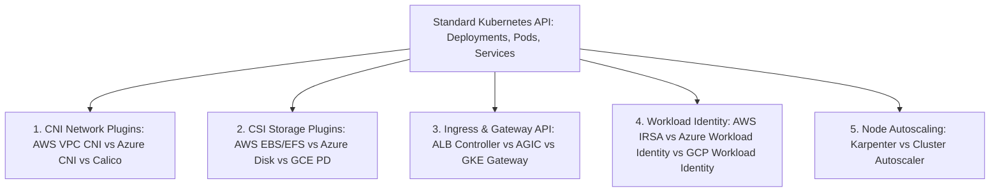

# The Reality of Kubernetes Portability

## Executive Summary

Kubernetes is frequently claimed to provide total cloud portability ("run on any cloud without changes"). While Kubernetes provides a standardized API for container scheduling, **production Kubernetes clusters rely heavily on provider-specific infrastructure plugins**.

---

## 1. The Five Hidden Layers of K8s Non-Portability

---

## 2. Portability Pitfalls & Mitigations

| Kubernetes Component | Provider Implementation Variance | Portability Mitigation |
| :--- | :--- | :--- |
| **Storage Classes (CSI)**| `gp3` (AWS) vs `managed-csi` (Azure) vs `pd-balanced` (GCP) | Parameterize `storageClassName` in Helm/Kustomize values files; never hardcode provider storage classes in base manifests. |
| **Ingress Controllers** | AWS ALB Ingress requires proprietary annotations (`alb.ingress.kubernetes.io/*`); Azure uses AGIC. | Standardize on an in-cluster software ingress controller (e.g., **Ingress-NGINX** or **Traefik**) across all clouds; point provider L4 load balancers at the ingress fleet. |
| **Workload Identity** | IAM role binding mechanisms vary drastically across providers. | Abstract identity bindings using service account annotations parameterized per environment in GitOps repositories. |
