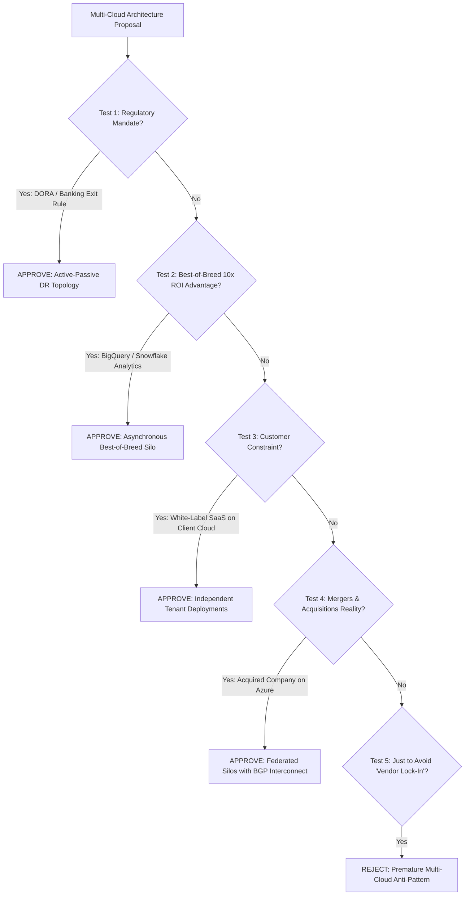

# Multi-Cloud Architecture Decision Framework

```yaml
status: approved
decision_type: framework
scope: enterprise-multi-cloud
owners: architecture-review-board
review_cadence: semi-annual
```

## Executive Summary

Multi-cloud adoption introduces exponential operational complexity. This decision framework ensures that multi-cloud is approved **only when justified by compelling business value or mandatory regulatory risk mitigation**.

---

## 1. The Multi-Cloud Gauntlet: Five Validation Tests

A multi-cloud proposal must pass all five criteria before receiving Architecture Review Board (ARB) approval:



---

## 2. The Decision Scorecard

| Proposal Scenario | ARB Decision | Recommended Topology | Justification & Guardrails |
| :--- | :--- | :--- | :--- |
| **"We want to split traffic 50/50 across AWS and GCP to achieve 99.999% uptime."** | **REJECTED** | Single-cloud Multi-Region | High latency, split-brain failure modes, and exponential operational complexity will reduce, not increase, overall uptime. |
| **"European banking regulator mandates verified disaster recovery outside primary provider."**| **APPROVED** | Active-Passive / Pilot Light | Legally required for operating license. Asynchronous replication only; human-gated failover. |
| **"Our operational OLTP is in AWS, but our data science team requires Google BigQuery."** | **APPROVED** | Best-of-Breed Asynchronous Silo | Valid architectural specialization. Enforce parquet compression across interconnect to control egress fees. |
| **"We sell an enterprise B2B SaaS product and key clients refuse to run on AWS."** | **APPROVED** | Multi-Cloud Tenant Deployments | Legitimate commercial requirement. Deploy independent, isolated full-stack instances per client cloud. |
